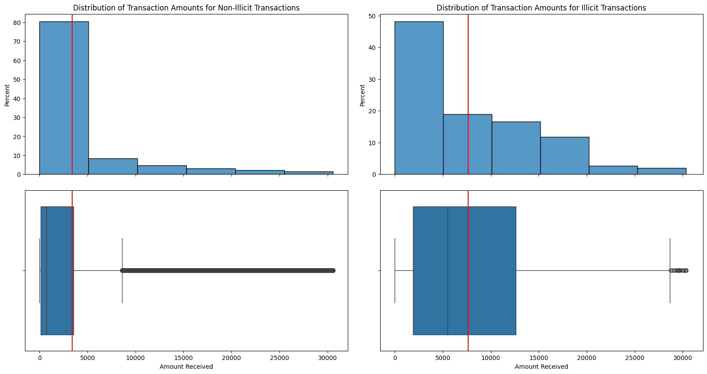
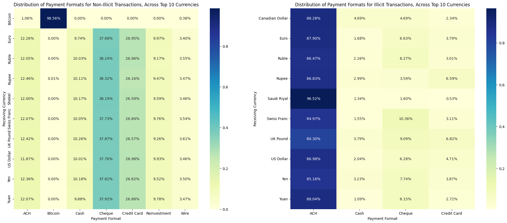
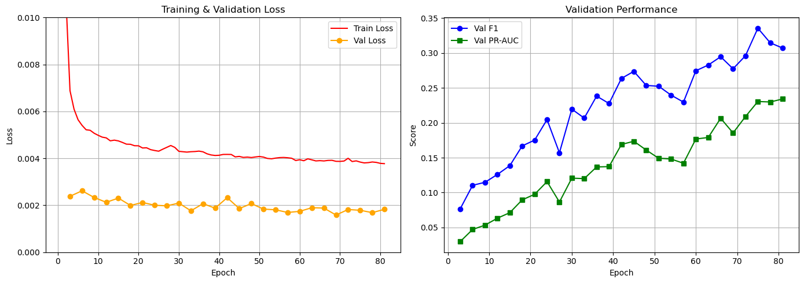
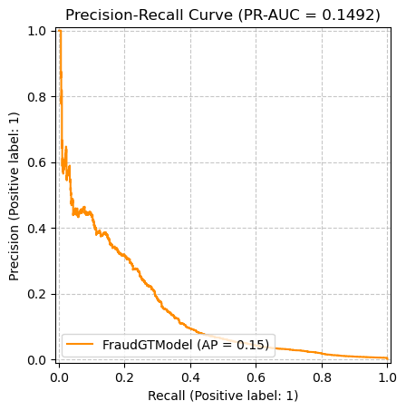
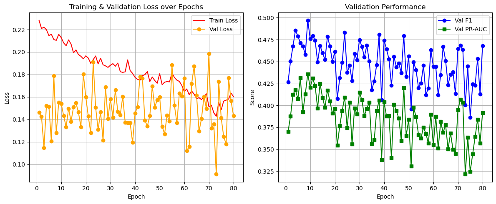
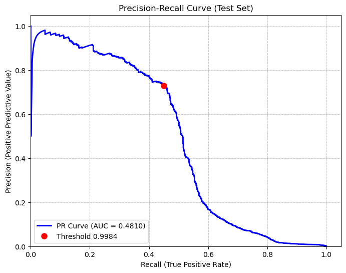

# Graph Neural Networks (GNN) for Money Laundering Detection


## 📄 Project Overview
Final project for UCLA STATS 426 (Deep Learning). We treat anti-money
laundering (AML) detection as a graph problem: bank accounts are nodes,
transactions are directed edges, and the task is to flag the tiny fraction
of edges that represent laundering. Using the **IBM AML dataset**
(`HI-Small_Trans.csv`, ~5.08M transactions, only **0.10%** labeled as
laundering), we built and compared three approaches — an XGBoost baseline
with hand-engineered graph features, a **Graph Transformer (FraudGT)**, and
a **Graph Neural Network with Principal Neighbourhood Aggregation
(Multi-PNA)** — to see how much a model that can directly learn from
transaction-graph structure gains over tabular features alone.

**Full Analysis:** [Read the Final Report (PDF)](docs/STATS_426_Final_Report.pdf) · [Presentation (PPTX)](docs/STATS_426_Final_Presentation.pptx)

## 📊 Dataset & EDA
[IBM Transactions for Anti-Money Laundering (AML)](https://www.kaggle.com/datasets/ealtman2019/ibm-transactions-for-anti-money-laundering-aml)
— the `HI-Small` split. Each row is a transfer between two accounts, with
sender/receiver bank, currency, amount, payment format (ACH, wire, credit
card, etc.), and an `Is Laundering` label. Not included in this repo —
download from Kaggle and point the scripts/notebooks at your local copy.

* **5,078,345 transactions**, of which only **~5,200 (0.10%)** are labeled
  laundering — a far more extreme imbalance than typical fraud datasets, and
  the central challenge the rest of the project works around.
* Illicit transactions skew toward **larger amounts** and a **wider spread**
  than benign ones (see distribution below) — laundering activity is less
  concentrated near small, routine transfer sizes.
* Payment format tells a clear story: for **non-illicit** transactions,
  ACH/Cheque/Credit Card/Cash are all used in reasonable proportions. For
  **illicit** transactions, **ACH dominates overwhelmingly (80–96% across
  every top currency)** — laundering activity in this dataset concentrates
  in a specific transfer channel rather than spreading evenly across
  payment methods.





Full EDA (nulls, dtypes, currency mix, temporal patterns) is in
[`notebooks/STATS426_Project_Initial_EDA.ipynb`](notebooks/STATS426_Project_Initial_EDA.ipynb).

## 🧠 Methodology
Because laundering is a *relational* pattern (money moving through chains
and clusters of accounts) rather than a property of a single transaction in
isolation, graph structure is a natural signal — but it's expensive to
exploit well under 1000:1 class imbalance and tens of millions of edges. We
took three passes at the problem, each adding more structure:

1. **Baseline — XGBoost + hand-crafted graph features**
   (`src/xgboost_baseline.py`): builds a directed transaction graph with
   `networkx` and computes per-account PageRank, HITS hub/authority scores,
   and in/out-degree centrality, then feeds these alongside raw transaction
   features into a gradient-boosted tree classifier. This tests how far you
   get by *summarizing* graph structure into tabular features, without a
   model that learns over the graph directly.

2. **FraudGT — Graph Transformer**
   (`notebooks/Deep_Learning_Project_FraudGT_Final.ipynb`): a transformer
   -style attention mechanism operating over the transaction graph, letting
   each node attend to relevant neighbors rather than aggregating them
   uniformly. Trained with a custom loss and evaluated with a decision
   threshold tuned on validation F1.

3. **Multi-PNA — GNN with Principal Neighbourhood Aggregation**
   (`notebooks/Deep_Learning_Project_MultiPNA_Final.ipynb`): combines
   multiple aggregators (mean, max, min, std) scaled by node degree, which
   is designed to capture more of a neighborhood's structure than a single
   aggregator can. To handle both the class imbalance and GPU memory limits
   at this graph scale, we **undersampled** the majority class during
   training and evaluated on the untouched, fully imbalanced test set.

For both GNNs, the decision threshold was tuned on a validation set (not
the default 0.5) since at this level of imbalance a naive threshold makes
the minority class nearly unreachable.

## 📈 Key Results

| Model | F1 | Precision | Recall | ROC-AUC | PR-AUC |
|---|---|---|---|---|---|
| FraudGT (Graph Transformer) | 0.315 | 0.274 | 0.240 | 0.962 | 0.149 |
| **Multi-PNA (GNN)** | **0.557** | **0.731** | 0.449 | **0.978** | **0.481** |

Multi-PNA was the strongest model by a wide margin on every metric except
recall, where it traded some sensitivity for far higher precision (0.73 vs.
0.27) — at 1000:1 imbalance, that precision gap is the difference between a
model whose alerts are mostly false positives and one an investigator could
plausibly act on. Its **PR-AUC of 0.48** (vs. 0.15 for FraudGT) is the more
informative comparison of the two ROC-AUC numbers, since ROC-AUC is easily
inflated by the overwhelming majority class in this setting.

**FraudGT — training curves and precision/recall tradeoff:**




**Multi-PNA — training curves and precision/recall tradeoff:**




Full ablations, threshold-selection details, and discussion of why the
graph-transformer approach underperformed the PNA-based GNN are in
[`docs/STATS_426_Final_Report.pdf`](docs/STATS_426_Final_Report.pdf) and
[`docs/STATS_426_Final_Presentation.pptx`](docs/STATS_426_Final_Presentation.pptx).

## 📂 Repository Structure
```
notebooks/
  STATS426_Project_Initial_EDA.ipynb        EDA: schema, nulls, class imbalance, currency/payment analysis
  Deep_Learning_Project_FraudGT_Final.ipynb  Graph Transformer model: architecture, training, evaluation
  Deep_Learning_Project_MultiPNA_Final.ipynb GNN (Multi-PNA) model: undersampling, training, evaluation
src/
  xgboost_baseline.py                       Graph-feature engineering (PageRank, HITS, centrality) + XGBoost baseline
docs/
  STATS_426_Final_Report.pdf                Full written report
  STATS_426_Final_Presentation.pptx         Presentation slides
assets/                                     Charts used in this README
```

## 🛠️ Tools Used
* **Libraries**: PyTorch, PyTorch Geometric, `networkx`, `xgboost`,
  `scikit-learn`, `pandas`, `seaborn`/`matplotlib`
* **Infrastructure**: Google Colab (GPU runtime)

## Setup
Update the hardcoded dataset path at the top of each notebook/script to
point to your local copy of `HI-Small_Trans.csv` before running (the
dataset itself is not committed — see [Dataset & EDA](#-dataset--eda)).
